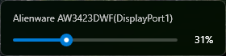
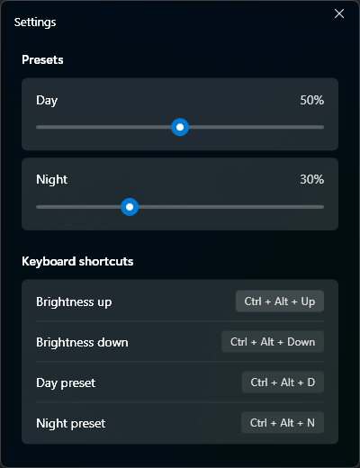

# Lumiere

A lightweight Windows app to control monitor brightness via DDC/CI.




## Features

- **System tray app** - Lives in your taskbar, click to adjust brightness
- **Multi-monitor support** - Control each monitor independently
- **Customizable keyboard shortcuts** (defaults):
  - `Ctrl+Alt+Up` - Increase brightness by 5%
  - `Ctrl+Alt+Down` - Decrease brightness by 5%
  - `Ctrl+Alt+D` - Day mode preset
  - `Ctrl+Alt+N` - Night mode preset
- **Day/Night presets** - Quickly switch between brightness levels
- **Windows 11 Mica** - Native look with translucent backdrop and system accent color

## Requirements

- Windows 10/11
- .NET 8 Desktop Runtime
- Monitor with DDC/CI support

## Building

```bash
cd src/Lumiere
dotnet build
```

## Publishing

```bash
dotnet publish -c Release -r win-x64 --self-contained false -p:PublishSingleFile=true -o publish
```

## License

MIT
